# GoogleSerialPort

Android NDK开发入门，零基础，已Google官方串口通信作为例子

----

## JNI简介

JNI（Java Native Interface），是方便Java调用C/C++等Native代码封装的一层接口。

## NDK是什么

NDK（Native Development Kit缩写）一种基于原生程序接口的软件开发工具包，可以让您在 Android 应用中利用 C 和 C++
代码的工具。通过此工具开发的程序直接在本地运行，而不是虚拟机。

在Android中，NDK是一系列工具的集合，主要用于扩展Android
SDK。NDK提供了一系列的工具可以帮助开发者快速的开发C或C++的动态库，并能自动将so和Java应用一起打包成apk。同时，NDK还集成了交叉编译器，并提供了相应的mk文件隔离CPU、平台、ABI等差异，开发人员只需要简单修改mk文件（指出“哪些文件需要编译”、“编译特性要求”等），就可以创建出so文件。

使用NDK有如下好处：

1、提高代码安全性。由于apk的java层代码很容易被反编译，而so库反编译比较困难

2、可以很方便的使用目前已有的C/C++开源库

3、便于平台间的移植。通过C/C++实现的动态库可以很方便的在其他平台上使用

4、提高程序在某些特定情形下的执行效率，但是并不能明显提升Android程序的性能

### 1、新建项目

先直接新建一个普通项目（为了好理解，也更贴近实际工作，这里不直接新建C/C++项目），建好之后如下图：

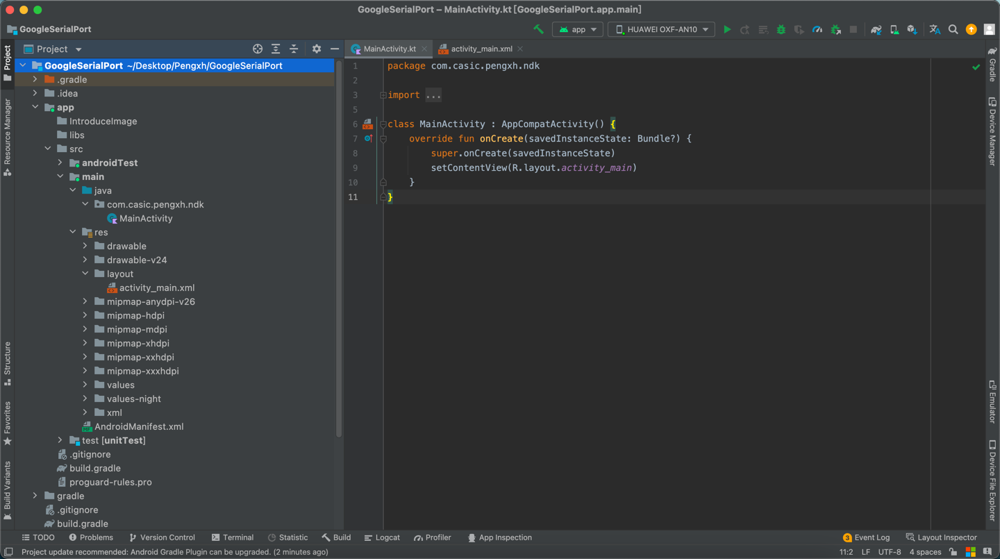

### 2、配置NDK环境

点击Android Studio右上角</br>
选择【SDK Tools】下载配置NDK，如下所示。

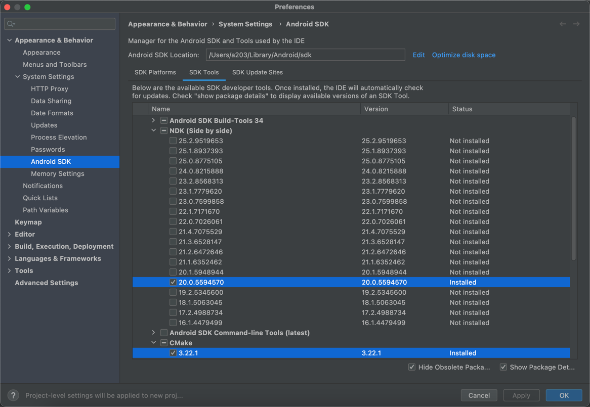

NDK编译 .so 库有两种方式。一种是ndk-build，另一种是CMake，咱先用传统的ndk-build方式生成我们需要的 .so 库。

### 3、在Android项目中声明Native方法，如下所示：

```Java
public class SerialPort {
    private static final String TAG = "SerialPort";

    /**
     * .so 库名字。需要去掉生成时自带的lib前缀
     * */
    static {
        System.loadLibrary("serial_port");
    }

    /**
     * JNI
     * <p>
     * 必须用 native 标识JNI方法
     */
    private native static FileDescriptor open(String path, int baudRate, int flags);

    public native void close();
}
```

然后选择【Build】--->【Make
Project】一下项目，完成后会在工程目录app/build/intermediates/javac/debug/classes/com/casic/pengxh/ndk/uart下看到编译后的SerialPort文件，如下图：

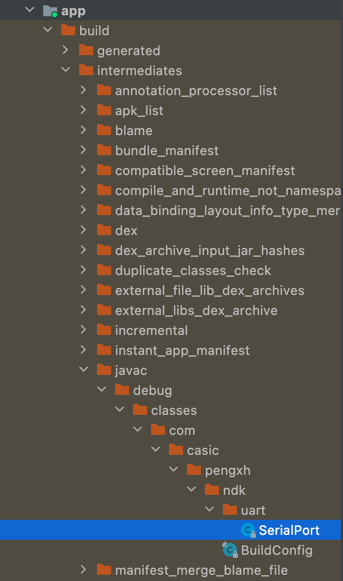

### 4、在java文件夹同级别新建jni文件夹

### 5、新建 .sh 脚本（SerialPort.h）

此脚本的目的是未了根据声明了native方法的文件生成C/C++头文件

```shell
#!/bin/sh
javah -o SerialPort.h -jni -classpath ../java com.casic.pengxh.ndk.uart.SerialPort

```

点击此文件左上角绿色小三角直接运行就会在jni文件夹下生成C/C++头文件，如下图所示：

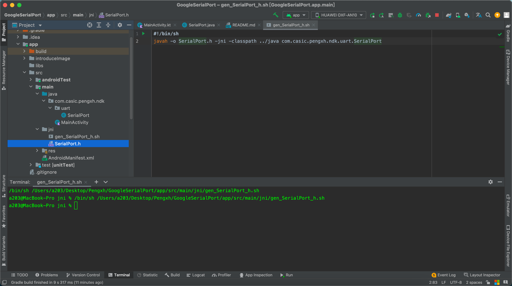

SerialPort.h是自动生成的头文件，里面的任何字段以及方法都不能修改，否则需要重新编译生成头文件

### 6、创建本地源码文件（SerialPort.c）

鼠标右键依次选择【jni】--->【New】--->【C/C++ Source File】，输入和此前头文件相同的名字，Type选择 .c ，最后点击【OK】

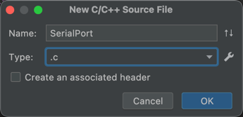

SerialPort.c源码包含三个函数，波特率、打开串口、关闭串口。直接复制Google源码就行。
地址（https://github.com/cepr/android-serialport-api/blob/master/android-serialport-api/project/jni/SerialPort.c）

### 7、完善SerialPort逻辑，完整代码如下：

```java
public class SerialPort {
    private static final String TAG = "SerialPort";

    /**
     * .so 库名字。需要去掉生成时自带的lib前缀
     * */
    static {
        System.loadLibrary("serial_port");
    }

    /**
     * JNI
     * <p>
     * 必须用 native 标识JNI方法
     */
    private native static FileDescriptor open(String path, int baudRate, int flags);

    public native void close();

    /**
     * Do not remove or rename the field mFd: it is used by native method close();
     */
    private FileDescriptor mFd;
    private final FileInputStream mFileInputStream;
    private final FileOutputStream mFileOutputStream;

    public SerialPort(File device, int baudrate, int flags) throws SecurityException, IOException {

        if (!device.canRead() || !device.canWrite()) {
            try {
                Process su;
                su = Runtime.getRuntime().exec("/system/bin/su");
                String cmd = "chmod 666 " + device.getAbsolutePath() + "\n"
                        + "exit\n";
                su.getOutputStream().write(cmd.getBytes());
                if ((su.waitFor() != 0) || !device.canRead() || !device.canWrite()) {
                    throw new SecurityException();
                }
            } catch (Exception e) {
                e.printStackTrace();
                throw new SecurityException();
            }
        }

        mFd = open(device.getAbsolutePath(), baudrate, flags);
        if (mFd == null) {
            Log.e(TAG, "native open returns null");
            throw new IOException();
        }
        mFileInputStream = new FileInputStream(mFd);
        mFileOutputStream = new FileOutputStream(mFd);
    }

    public InputStream getInputStream() {
        return mFileInputStream;
    }

    public OutputStream getOutputStream() {
        return mFileOutputStream;
    }
}
```

### 8、在Module的build.gradle添加ndk节点，如下所示：

```groovy
    defaultConfig {
    ndk {
        moduleName "serial_port"
        //"log"表示加入Android Logcat日志，需要导入 #include "android/log.h"
        ldLibs "log"
    }
}
```

### 9、在jni目录下创建Android.mk文件和Application.mk文件

### 10、编译 .so 库

经过以上9个步骤，jni下面的文件结构应该是这样的：

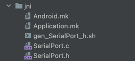

直接在Android Studio里面打开Terminal，进入到jni目录输入以下命令

```shell
a203@MacBook-Pro jni % ndk-build
```

| 问题      | 解决方案 |
| ---      |  ----   |
| zsh: command not found: ndk-build      | ndk环境没有在电脑上配置，参考SDK配置ADB路径，或者直接带着ndk全路径执行此命令       |
| ERROR: Unknown host CPU architecture: arm64   |   这是因为Mac M1芯片还未完全兼容，在命令行前面加上"arch -x86_64" ，比如：arch -x86_64 /Users/a203/Library/Android/sdk/ndk/20.0.5594570/ndk-build   |

出现如下信息即为编译成功

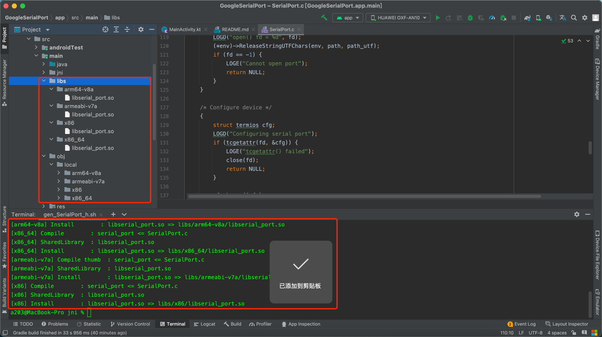

然后将libs下面的所有文件夹全部复制到jniLibs下面即可

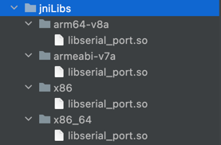

## 编译出来的 .so 库怎么用？

还是以串口通信为例，这个对于Android开发来说较简单也较实用

先上一下Demo最终文件结构

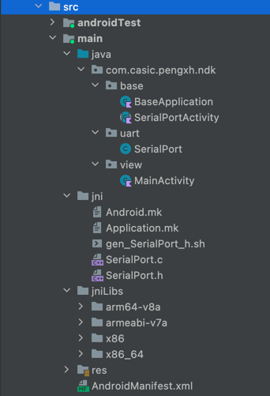

1、BaseApplication：主要是打开/关闭串口等初始化操作

```kotlin
class BaseApplication : Application() {

    private val kTag = "BaseApplication"
    private var serialPort: SerialPort? = null

    @Throws(SecurityException::class, IOException::class, InvalidParameterException::class)
    fun getSerialPort(): SerialPort? {
        if (serialPort == null) {
            /**
             * Open the serial port，以实际情况为准
             * */
            serialPort =
                SerialPort(File("/dev/ttysWK1"), 9600, 0)
        }
        return serialPort
    }

    companion object {
        private var application: BaseApplication by Delegates.notNull()

        fun get() = application
    }

    override fun onCreate() {
        super.onCreate()
        application = this
    }

    fun closeSerialPort() {
        if (serialPort != null) {
            serialPort?.close()
            serialPort = null
        }
    }
}
```

2、SerialPortActivity是个抽象类，集中处理串口通信

```kotlin
abstract class SerialPortActivity : AppCompatActivity() {

    private val kTag = "SerialPortActivity"
    private var serialPort: SerialPort? = null
    var outputStream: OutputStream? = null
    private var inputStream: InputStream? = null
    private var readThread: ReadThread? = null

    inner class ReadThread : Thread() {
        override fun run() {
            super.run()
            while (!isInterrupted) {
                var size: Int
                try {
                    val buffer = ByteArray(64)
                    if (inputStream == null) return
                    size = inputStream!!.read(buffer)
                    if (size > 0) {
                        onDataReceived(buffer, size)
                    }
                } catch (e: IOException) {
                    e.printStackTrace()
                    return
                }
            }
        }
    }

    override fun onCreate(savedInstanceState: Bundle?) {
        super.onCreate(savedInstanceState)
        setContentView(initLayoutView())
        setupTopBarLayout()
        initData(savedInstanceState)
        observeRequestState()
        initEvent()

        try {
            serialPort = BaseApplication.get().getSerialPort()
            outputStream = serialPort?.outputStream
            inputStream = serialPort?.inputStream

            readThread = ReadThread()
            readThread?.start()
            Toast.makeText(this, "串口已打开！", Toast.LENGTH_SHORT).show()
            Log.d(kTag, "onCreate => 串口已打开！")
        } catch (e: SecurityException) {
            Toast.makeText(this, "您没有串口的读写权限！", Toast.LENGTH_SHORT).show()
        } catch (e: IOException) {
            Toast.makeText(this, "因为不明原因，串口无法打开！", Toast.LENGTH_SHORT).show()
        } catch (e: InvalidParameterException) {
            Toast.makeText(this, "请检查串口！", Toast.LENGTH_SHORT).show()
        }
    }

    /**
     * 初始化xml布局
     */
    abstract fun initLayoutView(): Int

    /**
     * 特定页面定制沉浸式状态栏
     */
    abstract fun setupTopBarLayout()

    /**
     * 初始化默认数据
     */
    abstract fun initData(savedInstanceState: Bundle?)

    /**
     * 数据请求状态监听
     */
    abstract fun observeRequestState()

    /**
     * 初始化业务逻辑
     */
    abstract fun initEvent()

    /**
     * 串口读数
     * */
    abstract fun onDataReceived(buffer: ByteArray?, size: Int)

    override fun onDestroy() {
        readThread?.interrupt()
        BaseApplication.get().closeSerialPort()
        serialPort = null
        super.onDestroy()
    }
}
```

3、SerialPort前文已经详细介绍过了，不赘述了

4、MainActivity继承SerialPortActivity，实现具体的业务逻辑

5、AndroidManifest.xml，配置串口信息，权限等，如下图：

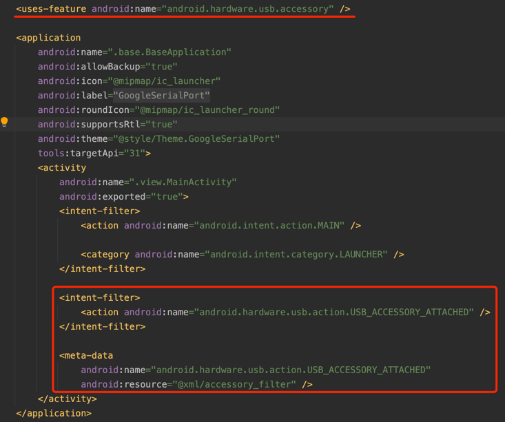

最后截个运行截图：

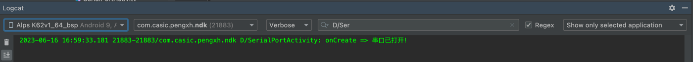

-----
以上是通过传统的ndk-build方式实现 .so 库编译，接下来介绍另一种更先进的编译方式：CMake交叉编译